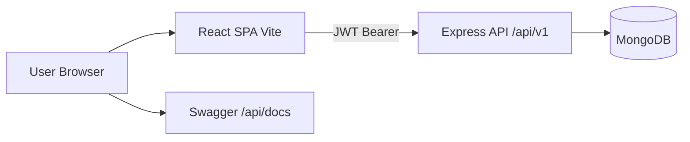
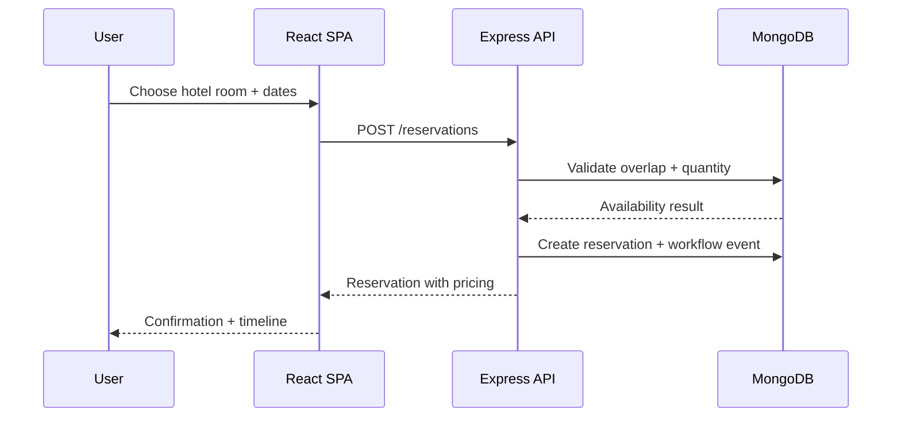
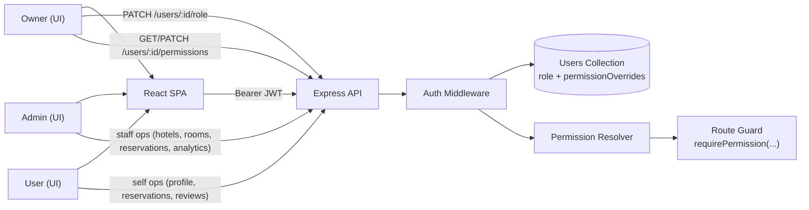

# Technical Requirements Document (TRD)

## 0. Locked Decisions
- Runtime target: **local-only** (frontend dev server + backend dev server + local/Atlas Mongo).
- Frontend forms: **Formik + Yup**
- Frontend UI framework: **Material-UI v9 + Emotion** end-to-end.
- Hotel images: URL string fields populated with placeholder links via the seed script.
- Reservation completion: computed **lazily on read** (no scheduler).
- Refresh tokens / httpOnly cookie auth: out of scope.

## 1. Stack

### Frontend (`/frontend`)
- React 19 + Vite
- React Router v7 for routing
- **Material-UI v9 + Emotion** is the only component library. All shells (AppBar/Toolbar/Container), all forms (TextField/Select/Checkbox/Slider/Button), all surfaces (Card/Paper/Dialog/Alert/Skeleton/Pagination/Chip/Rating), all icons (`@mui/icons-material`), and the date pickers (`@mui/x-date-pickers` + dayjs) are MUI. The provider chain is wired in `app/Providers.jsx`: `BrowserRouter → ThemeProvider → CssBaseline → LocalizationProvider → AuthProvider`.
- **Formik + Yup** for form state and validation. Field-level integration via the `FTextField` helper in `lib/formik-mui.jsx`.
- HTTP: axios (single shared `apiClient` with interceptors).
- State: React context for current user/session; component-local state for everything else (no Redux).
- ESLint for linting.

> Tailwind, shadcn, Radix, lucide-react, clsx, class-variance-authority, and tailwind-merge are all uninstalled.

### Backend (`/backend`)
- Node.js (ESM) + Express 5
- MongoDB via Mongoose 9
- Auth: jsonwebtoken (HS256) + bcryptjs
- Validation: Joi v18
- Middleware: helmet, cors, morgan, dotenv
- Tests: Jest + Supertest (`node --experimental-vm-modules ...jest.js`)
- Docs: swagger-jsdoc + swagger-ui-express, served at `/api/docs`

## 2. Repository Layout
```
/frontend
  src/
    app/           # Providers (MUI/Localization/Auth), App, Home, NotFound
    components/
      shared/      # Layout, Navbar (avatar dropdown), Footer, ConfirmDialog, UserAvatar
    features/
      auth/        # AuthContext, Yup schemas, api, login/register/profile pages
      hotels/      # api, filters, HotelCard, HotelFilters, list + details pages
      reservations/# api, schemas, ReserveDialog, ReservationCard, current + history pages
      notifications/# api, polling hook, notifications page
      analytics/# admin occupancy insights page
      users/       # admin user-role management page
      reviews/     # api, schemas, ReviewForm, ReviewItem, ReviewsSection
    hooks/         # useAuth, useDebouncedValue
    lib/           # apiClient (axios), env, formik-mui, imageResize
    routes/        # AppRoutes, ProtectedRoute, PublicOnlyRoute
/backend
  src/
    config/        # env loader, db connection
    controllers/   # thin asyncHandler wrappers
    docs/          # Swagger setup
    middleware/    # auth, errorHandler, notFound, security, validate
    models/        # User, Hotel, Room, Reservation, Review, Notification
    routes/v1/     # health, auth, users, hotels, reservations, notifications, analytics, reviews
    scripts/       # seed.js
    services/      # business logic per resource
    utils/         # ApiError, asyncHandler, response (ok/created)
    validators/    # Joi schemas
    app.js, server.js
  tests/           # one suite per endpoint group
```

## 2.1 Architecture Diagrams (Mermaid + Draw.io)
This project includes architecture diagrams in both required formats:
- Mermaid diagrams in this TRD section.
- Mermaid source files:
  - `docs/architecture-system-context.mmd`
  - `docs/architecture-reservation-workflow.mmd`
  - `docs/architecture-access-control.mmd`
- Draw.io source file: `docs/architecture.drawio`.

### Mermaid — System Context


### Mermaid — Reservation Workflow


## 3. API Contract Style

### Response envelope
Every successful response follows:
```json
{
  "success": true,
  "data": <payload>,
  "meta": { "page": 1, "pageSize": 10, "total": 42 }   // only for paginated lists
}
```

### Error envelope
```json
{
  "success": false,
  "error": {
    "code": "VALIDATION_ERROR",
    "message": "Human-readable summary",
    "details": [
      { "field": "email", "message": "must be a valid email" }
    ]
  }
}
```
- `code` is a stable machine-readable string (e.g. `VALIDATION_ERROR`, `UNAUTHORIZED`, `FORBIDDEN`, `NOT_FOUND`, `CONFLICT`, `INTERNAL_ERROR`).
- `details` is present only for validation errors; otherwise omitted.

### Status codes
| Code | When |
|------|------|
| 200 | Successful read / update / delete |
| 201 | Resource created |
| 204 | Successful delete with no body (we prefer 200 + envelope; 204 reserved) |
| 400 | Malformed request (bad JSON, missing required body) |
| 401 | Missing or invalid token |
| 403 | Authenticated but not allowed (e.g. cancelling someone else's reservation) |
| 404 | Resource not found |
| 409 | Conflict (duplicate email, room not available for given dates, double review) |
| 422 | Joi validation failure (we use 422 for validation, 400 for parse errors) |
| 500 | Unhandled server error |

## 4. Authentication
- Password hashing: bcryptjs, cost factor 10.
- Token: JWT (HS256) signed with `JWT_SECRET`, expiry from `JWT_EXPIRES_IN` (default 7d).
- Payload: `{ sub: userId, role }`.
- Storage: localStorage on the client. Refresh tokens / httpOnly cookie auth are out of scope for this release.
- Transport: `Authorization: Bearer <token>` header on every protected call.
- `authMiddleware` decodes the token, resolves effective permissions, attaches `req.user = { id, role, permissions }`, and rejects with 401 on missing/invalid/expired token.

## 4.1 Authorization
- Roles: `owner`, `admin`, `user`.
- Exactly one `owner` account is enforced by a unique partial index on `users.role = owner`.
- Route guards are permission-based (`requirePermission`), not role-branching.
- Base permissions are derived from role defaults.
- For `admin` users, owner can set per-user permission overrides (`allow[]`, `deny[]`).
- Effective permissions are computed server-side as: `role defaults + allow[] - deny[]`.
- Owner role permissions are not overrideable.

## 5. Validation
- Every write endpoint goes through a Joi schema via a shared `validate(schema, where)` middleware (`where` ∈ `body | params | query`).
- On failure → 422 + `VALIDATION_ERROR` with `details[]`.

## 6. Error Handling
- A single `errorHandler` middleware is the last `app.use`.
- Controllers wrap async work with `asyncHandler` so thrown errors reach the handler.
- The handler maps known error classes (`ApiError`, `mongoose.Error.ValidationError`, `mongoose.Error.CastError`, JWT errors, Joi errors) to the envelope above.
- In non-prod environments the response includes a `stack` field for debugging.

## 7. Configuration & Environment
- `.env.example` provides all required keys: `PORT`, `MONGO_URI`, `JWT_SECRET`, `JWT_EXPIRES_IN`, `CLIENT_URL`.
- Frontend uses Vite env vars: `VITE_API_BASE_URL` (default `http://localhost:5050/api/v1`).
- CORS allows the frontend origin from `CLIENT_URL`.

## 8. Testing
- Backend: Jest + Supertest. One integration test per route module covering happy path + at least one error path.
- Frontend: no formal unit tests in this release; manual QA checklist is used.

## 9. Documentation
- Swagger UI at `/api/docs` driven by JSDoc on each route.
- READMEs in `/frontend` and `/backend` describe install, env, run, test.
- API_PLAN.md is kept in sync with the served Swagger.

## 10. Quality Bar
- All write endpoints validated.
- All endpoints return the envelope above; no raw `res.json(doc)` allowed (a helper `ok(res, data)` enforces this).
- No secrets committed; `.env` is gitignored.
- ESLint passes on the frontend.

## 11. Pricing and Charges
- Reservation pricing is calculated server-side and persisted on each reservation:
  - `subtotal = nights * room.pricePerNight`
  - `serviceFee = 8%` of subtotal
  - `taxAmount = 14%` of `(subtotal + serviceFee)`
  - `totalPrice = subtotal + serviceFee + taxAmount`
- Frontend shows the same breakdown in reserve/confirmation/reservation views.

## 12. Reservation Workflow Tracking
- Reservation lifecycle is tracked as ordered workflow events on each reservation.
- Current events: `created`, `updated` (staff), `cancelled`.
- Each event includes actor role (`user`/`admin`/`owner`/`system`), message, and timestamp.
- Timeline is available from `GET /reservations/:id/timeline` and rendered in reservation pages.


### Mermaid — Access Control

